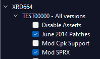
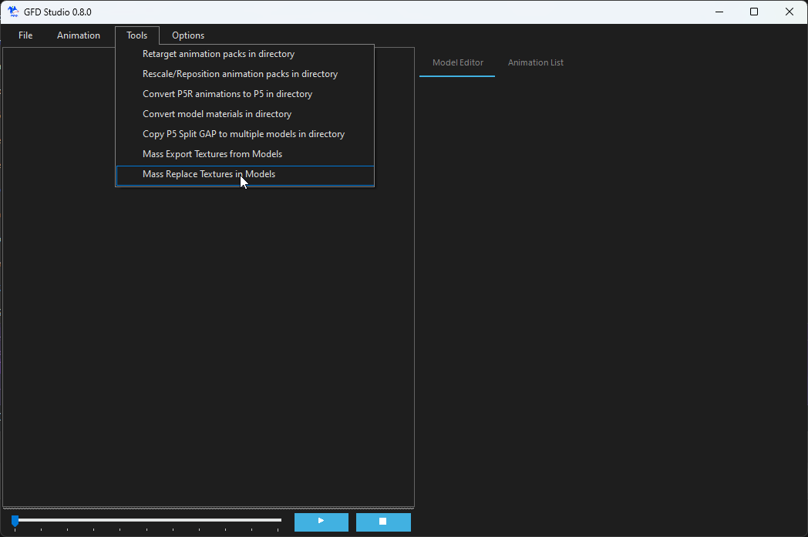
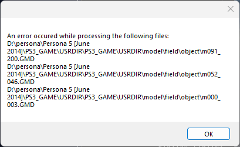

# Persona 5 June 2014
A collection of scripts to convert assets from the December 2015 build of Persona 5 to work with the June 2014 executable.

*Note that this is intended as a starting point for anyone interested in researching this particular executable. A lot of things will still make the game crash*

## Requirements
-  A copy of the full version of December 2015 (no bad sectors)
-  [Python 3.10 or higher](https://www.python.org/downloads/)
-  [GFD Studio](https://github.com/tge-was-taken/GFD-Studio/releases/tag/0.8.0)
-  [CriFsV2Lib](https://github.com/Sewer56/CriFsV2Lib) (any other tool that can extract CPKs can work here too, this is what I've used)

## Instructions
### Getting into the debug menu
Before beginning, **make a copy of your December 2015 folder**, since the following scripts will replace files in that given directory (I'm not trying to overwrite your 2015 eboot!)

Copy the contents of `patch.yml` into your RPCS3 patches and enable **June 2014 Patches** and **Mod SPRX** for TEST00000:\
\
Copy this repository's `config.yml` and `mod.sprx` into June 2014's `PS3_GAME/USRDIR` directory. Inside that folder, create a `PS3_GAME` and `USRDIR` folder inside that. The folder structure should look like this:
```
[path to p5 game]/PS3_GAME/USRDIR:
> PS3_GAME
    > USRDIR
        [empty directory]
- config.yml
- data.cpk
- EBOOT.BIN (this would be your 2015 eboot)
- hdd.cpk
- mod.sprx
- ps3.cpk
```
Extract the contents of `data.cpk`, `hdd.cpk` and `ps3.cpk` into the inner `PS3_GAME/USRDIR` folder using CriFsV2Lib.
```
[path to p5 game]/PS3_GAME/USRDIR:
> PS3_GAME
    > USRDIR
        > battle
        > bustup
        ...
- config.yml
- data.cpk
...
```
Run the python script `file_placement_init.py`, providing a path to the directory to the other `USRDIR` directory as a parameter:
```
python file_placement_init.py [path to p5 game]/PS3_GAME/USRDIR
```
**Output**
```
[path to p5 game]\PS3_GAME\USRDIR\PS3_GAME/USRDIR/swordtrack/SW.BIN -> [path to p5 game]\PS3_GAME\USRDIR\EBOOT.BIN
make fldAlertGauge
make fldCrouchOnly
...
[path to p5 game]\PS3_GAME/USRDIR\sample/script\test.bf -> [path to p5 game]\PS3_GAME\USRDIR\PS3_GAME/USRDIR\calendar\cldresult.bf
[path to p5 game]\PS3_GAME\USRDIR\PS3_GAME/USRDIR\calendar\day.plg -> [path to p5 game]\PS3_GAME\USRDIR\PS3_GAME/USRDIR\calendar\cldDate.plg
[path to p5 game]\PS3_GAME\USRDIR\PS3_GAME/USRDIR\font\icon.dds -> [path to p5 game]\PS3_GAME\USRDIR\PS3_GAME/USRDIR\resident\icon.dds
```
Once this is done, you can now start up the game to get into the debug menu. You'll know it's worked when it says `BUILD DATE Jun 13 2014 18:36:39` in the top right.
It may take a while on first boot since it'll be compiling shaders, but recent versions of RPCS3 will cache this to speed up loading times later on (I didn't do this back in my twitter thread so it'd take me several minutes to enter a field each time lol).

If you were to try to enter a field now, the game would error out with a message like `NOT EXIST FILE !!! model/field/f000_100_0.GFS !!!`. We'll need to do some other work to get loaded into a field:
### Getting into a field
Inside the model directory (so `[path to p5 game]/PS3_GAME/USRDIR/PS3_GAME/USRDIR/model/`), rename `field_tex` to `field`.
Then run `extract_texture_bins.py`, with the two parameters being the outer `USRDIR` directory that you used for the init script and a second directory where you want to dump the texture bin folders into
(e.g Given the command)\
`python extract_texture_bins.py [path to p5 game]/PS3_GAME/USRDIR /some/other/folder`\
The contents of `/some/other/folder` would have the following:
```
> tex000_002_00_00
    > bgTexArcData00.txt
    > f011_001_tr_btm_parts.DDS
    > f011_001_tr_btm_parts_ns.DDS
    ...
> tex000_002_00_01
> tex000_002_00_02
...
```
Open **GFD Studio**, then select Tools > Mass Replace Textures In Models
\
The first directory will be to your `model/field` folder, and the second directory will be the directory you used when running `extract_texture_bins.py`. The user interface will freeze for a while, but it'll show up a message box once it's completed:\
\
that's fine!!

After that, run `file_placement_field.py`. 
```
python file_placement_field.py [path to p5 game]/PS3_GAME/USRDIR
```
**Output**
```
[path to p5 game]\PS3_GAME\USRDIR\PS3_GAME/USRDIR\env\env000_000_000.ENV
[path to p5 game]\PS3_GAME\USRDIR\PS3_GAME/USRDIR\env\env000_001_000.ENV
[path to p5 game]\PS3_GAME\USRDIR\PS3_GAME/USRDIR\env\env000_002_000.ENV
...
cmpMoneyPanelString.ctd
camp_msg.bmd
cmpArbeitHelp.bmd
```
You should now be able to enter the test field `f000_100`. 

A lot of other fields should work as well, though you'll likely need to delete or rename their field init script and npc bin data as they'll likely crash the game. (Originally CLTs and SHTs would have done this too, but the field script will convert those to an format usable in June 2014)
### Getting into a battle
~~ Run `file_placement_battle.py`. ~~\
***THIS CURRENTLY DOESN'T ENTIRELY WORK***: One thing that I don't have an automated script for is to combine the `battle/gui/btl_menu_cmnd_front.GMD` and `battle/gui/btl_menu_cmnd_back.GMD` mesh files into `battle/gui/btl_cmnd.GMD`. You'll currently have to combine these files yourself using a tool such as [BlenderToolsForGFS](https://github.com/Pherakki/BlenderToolsForGFS) (I wasn't down to write my own gmd/gfs parser in python, though I suppose Pherakki's already done that for said blender plugin lmao).
There aren't many files that are needed to get a battle started, although there's still a lot of problems trying to play through battles that I haven't addressed.
## Details on this Build
*The stuff here may be useful for anyone interested in editing [the Dec 2015 TCRF article](https://tcrf.net/Proto:Persona_5/December_4th,_2015#SW.BIN).*\
On January 2024, several in development copies of Persona 5 (XRD664) that came from a private auction were ripped, with the earliest dated disk from December 4th, 2015, an Alpha 5 build. This executable, dated June 14th 2014, is an Alpha 3 build that was found inside December 2015 as `swordtrack/SW.BIN`. There are many significant differences from any other in development build that's publicly available, such as the inclusion of debug symbols.\

The sections below will give some additional information on things that I wanted to say in the [original Twitter article](https://twitter.com/rirurinuser/status/1776464115160187253) but didn't have the space to mention.
### GFD Engine
June 2014's GFD version is **0x1105020**, making it the earliest version of the GFD engine that we have access to. For reference, *Persona 4: Dancing All Night*, the first game released by Atlus to use GFD, released on 25th June 2015 uses version **0x1105030**, Alpha 5 uses **0x1105060** and the final release of Persona 5 uses version **0x1105070**

This is far from the earliest build of GFD that ever existed; Some of the oldest model files in the `sample` folder, such as `p3yukari.GFS` and `catherine02_01.GFS` have a file version number `0x1080000`. In particular, these very early models mention Gamebryo and XRD 649, the engine and codename used for OG Catherine respectively, and a file path to 3DS Max 2009.
In an article in Famitsu #1187, which released *August 2011*, Katsura Hashino mentioned that the Persona team had finished work on a new internal engine ([source](https://personacentral.com/persona-5-timeline/)), which suggests those files were made roughly around that time (2010-2011 most likely)
### Why Alpha 3?
I'm calling this an Alpha 3 build due to the sound effects that play during battle. There are several functions in the
`btl::Alpha3Sound` namespace, notably `btl::Alpha3Sound::PlayVoice` to play a particular entry in the waveform container and `btl::Alpha3Sound::Setup`, which loads in the file `sound/a3_voice_sample.awb`. This will currently be the only sound that will play in the game since the Criware libraries in Alpha 3 are too old to be compatible with the assets we currently have.
The `sound` folder also contains `sound/a2_voice_sample.awb`, a much smaller bank of files that we can assume were used in Alpha 2.
### Scripts
This build contains a significantly smaller amount of flowscript functions in it's library, so it's likely that any given flowscript file (.bf) that runs will cause the game to crash due to it trying to load an unsupported function, and there's no easy way to get around this other than to edit each flowscript file. For anyone interested in that particular iteration of P5's flowscript library, I have [a branch of Atlus Script Tools](https://github.com/rirurin/Atlus-Script-Tools/tree/p5_2014) that includes a June 2014 library.

As an additional note for anyone unaware, it is possible to open the `FIELD VIEWER` option in the debug menu since the files for it are available, they're just in the PS4 build of P5R (`test/nowatari` and `test/cv` in `dataR.cpk`). Again, due to the smaller flowscript library, pretty much all the options will crash the game.
### Debug Menu
After running the `file_placement_init` script, it'll be possible to boot into the debug menu that runs automatically on startup on debug builds.

(A lot of the 2014 debug menu exclusive stuff was covered in [Dniwe's twitter thread](https://twitter.com/dniwetamp/status/1749100264890552660))

The following covers the details of what the init script does:
- Creates the following FTD files:
```
field/ftd/fldAlertGauge.ftd
field/ftd/fldCrouchOnly.ftd
field/ftd/fldEntranceNo.ftd
field/ftd/fldNotFollow.ftd
field/ftd/fldOutdoor.ftd
field/ftd/fldPlayerSpeed.ftd
field/ftd/fldPrisoner.ftd
field/ftd/fldWalkOnly.ftd
```
Originally, `field/ftd/fldStateOnly.ftd` was several separate files (e.g if the game wanted to check if Joker should wear the prisoner outfit, `fldCmnGetPrisoner` is called to get the prisoner FTD, then `fldLocalCheckStateOnly` to see if the currently loaded field is a prisoner outfit field. In later builds, `fldPrisoner` is a list within `fldStateOnly`)
- Copies `init/msg_combine_lvup.bmd` into `P4G/facility/msg_combine_lvup.bmd`
- Creates `crowd2d_05.dds` and `crowd2d_06.dds` as a copy of `field/npc/crowd2d_01.dds`, placed into field/panel/wipe
- Adds new files into `init/fclTable.bin` and `init/datMsg.pak`
**fclTable.bin**
```
fclCombineBirthMessage.ftd
fclCombineGetPTMessage.ftd (not in P4G's fclTable.bin)
fclCombineTable_Fifth.ftd
fclCombineTable_Fourth.ftd
fclCombineTable_Sixth.ftd 
fclCombineTable_ThirdSP.ftd
fclCombineTable_Twelfth.ftd
fclComuLvExp.ftd
fclHelpTable_CELL2.ftd
fclHelpTable_COMBINE.ftd
fclHelpTable_ELVGIRL.ftd
fclHelpTable_ELVGIRL_ROOT.ftd
fclHelpTable_LIVER.ftd
fclHelpTable_SKLCARD_ROOT.ftd
fclHelpTable_SKLCARD0.ftd
fclHelpTable_SKLCARD1.ftd
fclHelpTable_SKLCARD2.ftd
fclHelpTable_USERCMM_ROOT.ftd
fclHelpTable_USERCMM0.ftd
fclHelpTable_USERCMM1.ftd
fclHelpTable_USERCMM2.ftd
fclMarieEvtTable.ftd
fclSklCardText.ftd
```
**datMsg.pak**\
`datQuestReward.bmd`
- Move `init/cmm.bin` into `P4G/init/cmm.bin`
- Move wipe textures in `init/evtWipeTex.pak`, into `test/ikeda/wipe/`
- rename `p5_field_day.spd` to `fld.spd` (calendar)
- create blank `cldResult.bmd` and `cldResult.bf` (calendar)
- rename `day.plg` to `cldDate.plg`
- copy `font/icon.dds` to `resident/icon.dds`
### Battle
The `field_placement_battle` python script does the following:
```
Create battle/gui/btl_cmnd.GMD
```
`battle/gui/btl_menu_cmnd_front.GMD` and `battle/gui/btl_menu_cmnd_back.GMD` were originally a single model file (the given model was also structured differently, a lot of which is controlled in the executable, which is why it doesn't display properly on Alpha 3)


When using a skill, these files are called and display things on screen:
```
Create font/assist/jm_base.spd
Create font/assist/jm_k003_00.spd
```
These files are loaded from the function `mesAssistListSyncSprite` by being added to `MsgAssist`'s  `mesAssistList_s->pSpriteLoad` list. In December 2015 and later builds, this instead calls `font/assist/bustup/b%03d_%03d.bin`, suggesting that June 2014 is loading a character navi sprite that looks like the portraits seen in [font/assist/chara](https://tcrf.net/Proto:Persona_5/December_4th,_2015/Graphics/Character_Portraits#Very_Early_Palace_Speech_Portraits). (`jm_base` would be the background speech bubble)
### What's that thing in the top right?
That's `field/panel/p5Wanted_01.spd`. My best guess is that would be the wanted portrait that we'd see as a [leftover in PS4 P5 and P5R](https://tcrf.net/Persona_5/Unused_Graphics#PlayStation_4_Exclusive_Unused_Graphics) (this is at `CAMP/WANTED/WANTED_11.DDS` in P5R Fiber), although that would be inside of a sprite file with numbers to fill in the EXP amount
### Crowd Layout Table
A good way I've found to get a rough date for when a given field was last updated is to check the version number of it's crowd layout table file (CLT). All the field models are versioned according to the GFD version they were made from (since these are from Dec 2015, that's 0x1105060), but this isn't the case with CLT files, so it'll have whatever version it had when it was last edited. December 2015 supports CLT versions up to **0x15111200**, while June 2014 only supports versions up to **0x14022500**. Using this, it's likely that field `f000_000` (version **0x14021600**) was last edited before this build was compiled (not that we have a model for it). For reference, Miyashita Park (`f001_007`) has a CLT version **0x14102800** (just after this build) and Yan Quijote (`f010_014`) has version **0x15052600**.
### Akechi's Palace? Akage?
No